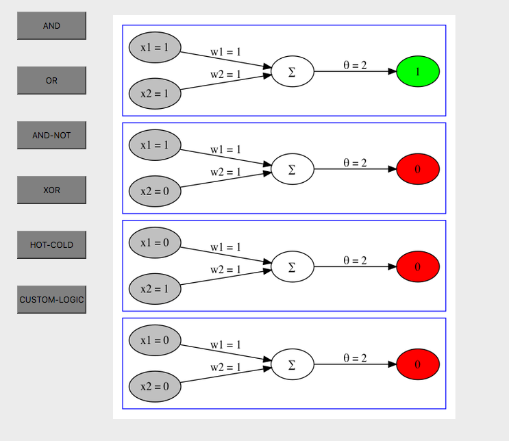
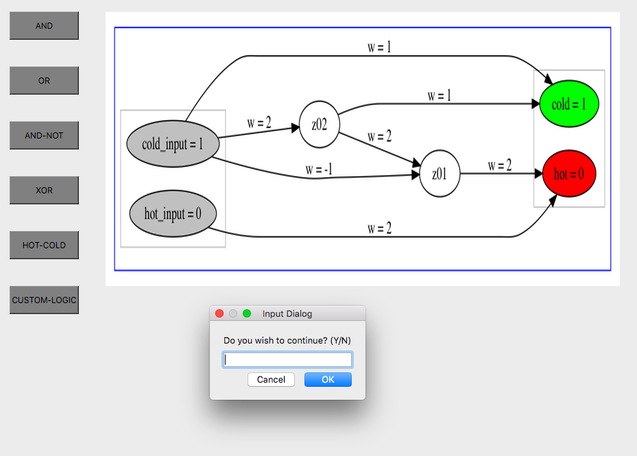
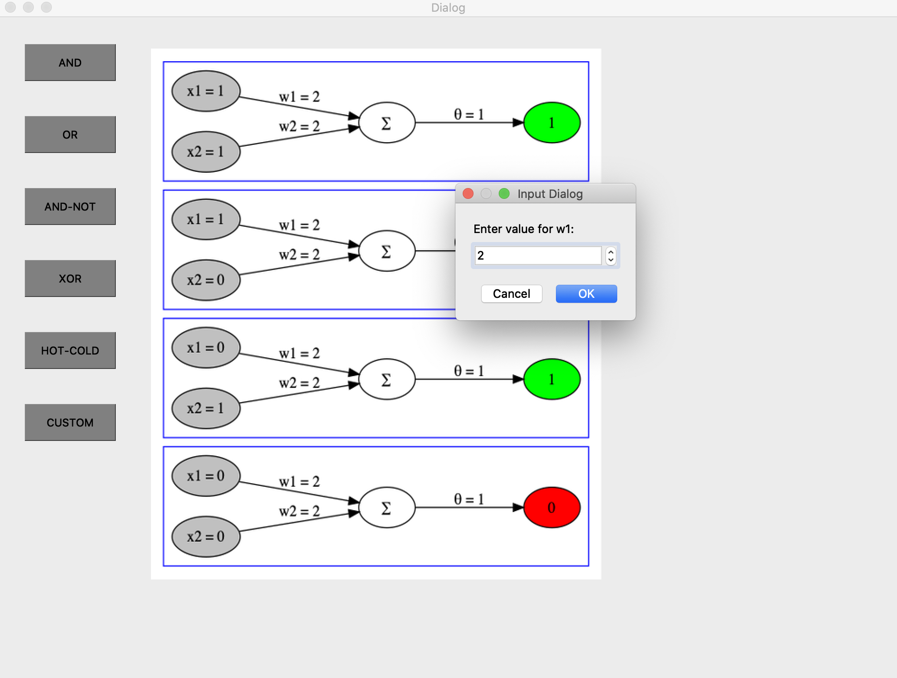

# NNFL ASSIGNMENT 2 

## Members:
- Ishita Mediratta
- Harnoor Dhingra
- Nidhi Ravishankar
- Jahanvi Shah
- Arshia Arya

## Packages required
- PyQt5
- graphviz
- PIL
- numpy

`pip install <package>`

## How to use?

1. Download the folder into an appropriate directory
2. Open Terminal and navigate to that particular folder using `cd` command
3. Execute `python graph.py`
4. A GUI will open up with 4 pre-defined logic gate AND, OR, AND-NOT, XOR and clicking on the corresponding buttons will result in output being generated in the graph format, for all four input values of X1 and X2 (00, 01, 10, 11)
      
5. For HOT-COLD button, initially you will be asked to input values `H` or `C` for two timestamps t-1 and t-2, and the corresponding output graph will be generated. Later on, you will be asked whether you want to continue with further iterations. The user can enter `Y` or `N` depending on his/her choice. Then again, the user will be prompted to enter `H` or `C` for the next iteration, and the corresponding graph would be generated. This process would continue until the user enters `N`.
      
6. For CUSTOM-LOGIC, the user will be prompted to enter integer values corresponding to `w1`, `w2` and `theta`, one by one, and the corresponding graph will be generated for those parameters. 
      

